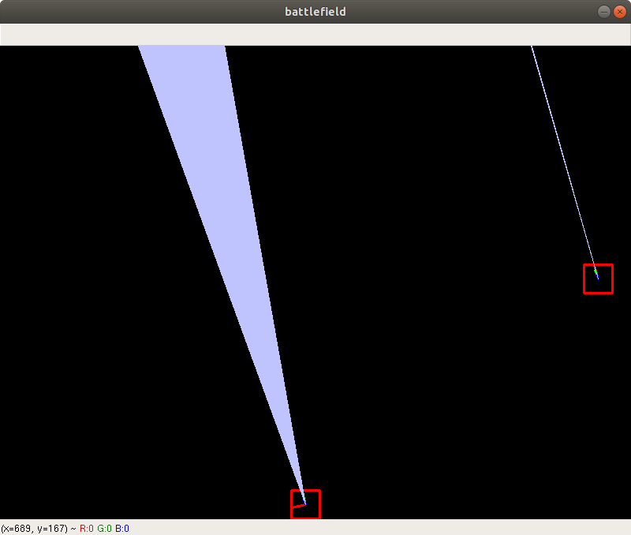
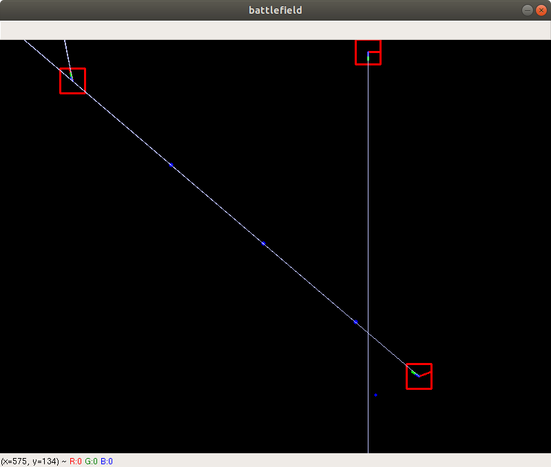

# Robopy

This is a programming game, where the goal is to develop a battle tank robot to battle against other tanks in Python. The robot battles run in real-time and on-screen.

Robopy is a translation of [Robocode](https://robocode.sourceforge.io) (Java to Python) aimed to be a version with few upgrades.

## Getting Started

This project isn't feature complete yet. Even so, it's possible to create robots, handle events, run battles and visualize it.

### Requirements

The requirements are listed in [requirements.txt](requirements.txt).

A virtual environment (using python-venv) can be generated by running:

```bash
source ./bin/venv python3
```

### Example

```python
from robopy.core.battle import Battle
from robopy.sample.target import Target
from robopy.sample.track_fire import TrackFire
from robopy.sample.walls import Walls
from robopy.ui.gui import GUI


if __name__ == "__main__":
    battle = Battle((800, 600), [Target, TrackFire, Walls])
    gui = GUI(battle)

    battle.start()
    gui.start()

    battle.join()
    gui.join()

```

#### Images

Target vs Walls | Target vs Track Fire vs Walls
:--------------:|:----------------------------:
 | 

## Contributing

We welcome contributions! See [CONTRIBUTING.md](CONTRIBUTING.md) to learn how to contribute.

## License

Robopy is licensed under the Eclipse Public License 1.0 license (the same as Robocode). See [LICENSE](LICENSE) file for details.
